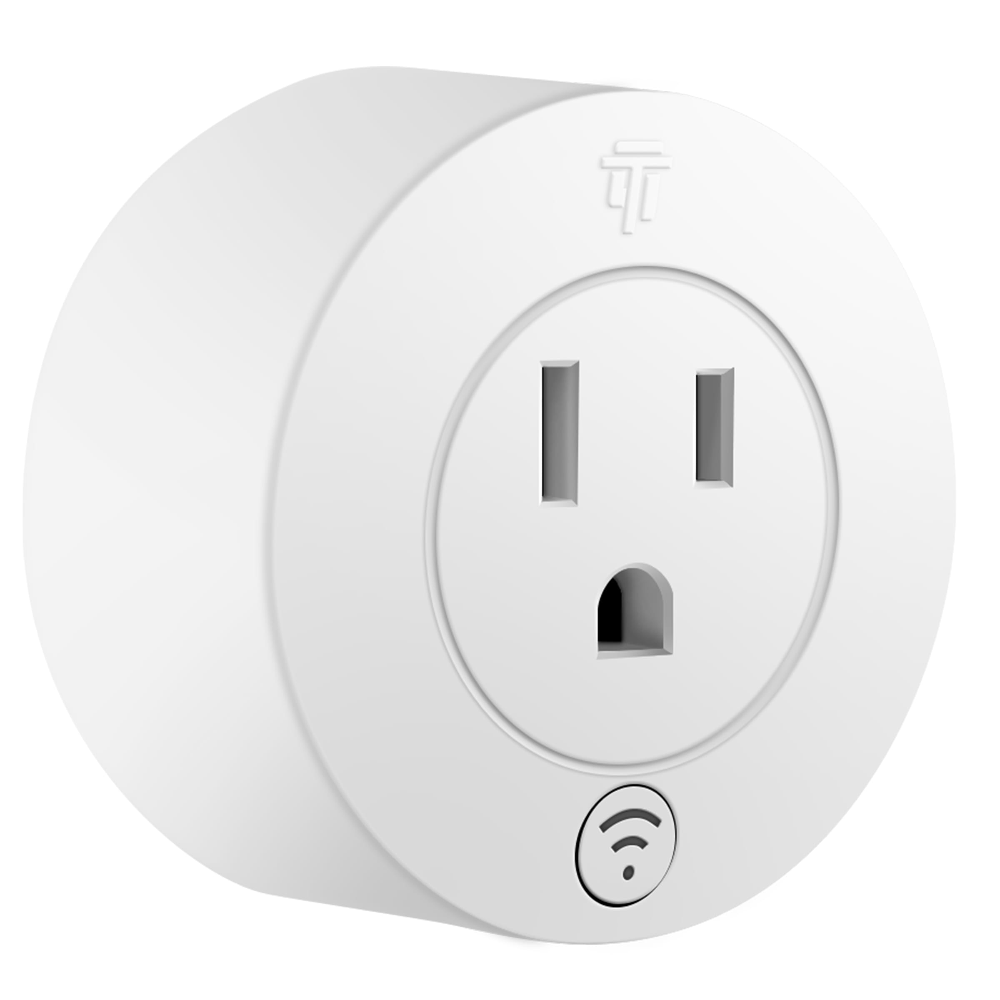
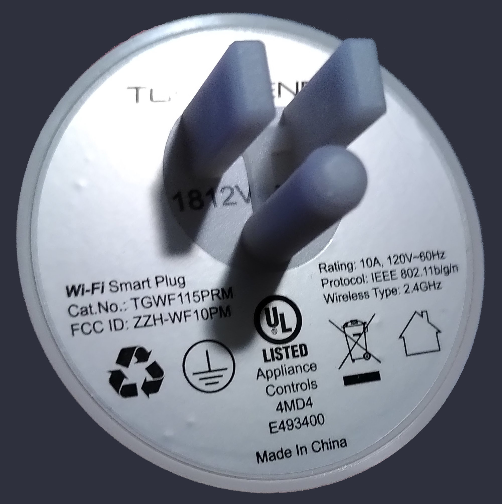

Product Images:
  
  

Model reference: Round Smart Wi-Fi Plug-In (10A) with Energy Monitoring

Manufacturer: [Topgreen](https://www.topgreener.com/)

## GPIO Pinout

| Pin    | Function                   |
|--------|----------------------------|
| GPIO03 | Push Button                |
| GPIO01 | Blue LED (Inverted: true)  |
| GPIO13 | Green LED (Inverted: true) |
| GPIO14 | Relay                      |
| GPIO12 | HLWBL SEL (Inverted: true) |
| GPIO04 | BL0937 CF                  |
| GPIO05 | HLWBL CF1                  |

## Basic Config

```yaml
substitutions:
  devicename: tgwf115prm_plug_1
  friendly_name: TopGreener PRM Plug 1
  device_description: TopGreener RPM Power Monitoring Plug with button and (Blue and Green) led.

esphome:
  name: ${devicename}
  comment: ${device_description}
  platform: ESP8266
  board: esp01_1m

wifi:
  ssid: !secret wifi_ssid
  password: !secret wifi_password

  # Enable fallback hotspot (captive portal) in case wifi connection fails
  ap:
    ssid: ${friendly_name}
    password: !secret fallback_wifi_password

  # manual_ip:
  #     static_ip: 192.168.x.xx
  #     gateway: 192.168.x.x
  #     subnet: 255.255.255.0

captive_portal:

# Enable logging
logger:

# Web server can be removed after enabling HA API
#web_server:
#  port: 80

# Enable Home Assistant API
api:
  password: !secret api_password

ota:
  password: !secret ota_password

# Enable time component for use by daily power sensor
time:
  - platform: homeassistant
    id: homeassistant_time

sensor:
# Reports how long the device has been powered (in minutes)
  - platform: uptime
    name: ${friendly_name} Uptime
    filters:
      - lambda: return x / 60.0;
    unit_of_measurement: minutes

# Reports the WiFi signal strength
  - platform: wifi_signal
    name: ${friendly_name} Wifi Signal
    update_interval: 60s

# Reports the Current, Voltage, and Power used by the plugged-in device
  - platform: hlw8012
    model: BL0937
    sel_pin:
      number: GPIO12
      inverted: True
    cf_pin: GPIO04
    cf1_pin: GPIO05
    change_mode_every: 8
    update_interval: 10s
    current:
      name: ${friendly_name} Amperage
      icon: mdi:current-ac
      unit_of_measurement: A
    voltage:
      name: ${friendly_name} Voltage
      icon: mdi:lightning-bolt-circle
      unit_of_measurement: V
    power:
      id: wattage
      name: ${friendly_name} Wattage
      icon: mdi:flash-outline
      unit_of_measurement: W

  # Reports the total Power so-far each day, resets at midnight, see https://esphome.io/components/sensor/total_daily_energy.html
  - platform: total_daily_energy
    name: ${friendly_name} Total Daily Energy
    icon: mdi:circle-slice-3
    power_id: wattage
    filters:
      # Multiplication factor from W to kW is 0.001
      - multiply: 0.001
    unit_of_measurement: kWh

binary_sensor:
# Button on the front is pressed and then toggle relay
  - platform: gpio
    device_class: power
    pin:
      number: GPIO03
      mode: INPUT_PULLUP
    name: ${friendly_name} Button # Name to make button visible in HA
    on_press:
      - switch.toggle: relay

text_sensor:
# Reports the ESPHome Version with compile date
  - platform: version
    name: ${friendly_name} ESPHome Version

# Reports detailed wifi info, can be commented out
  - platform: wifi_info
    ip_address:
      name: ${friendly_name} IP Address
    # ssid: # Some additional wifi info that is not normally needed
    #   name: ${friendly_name} Connected SSID
    # bssid:
    #   name: ${friendly_name} Connected BSSID

switch:
# Relay itself
  - platform: gpio
    name: ${friendly_name}
    pin: GPIO14
    id: relay
    restore_mode: RESTORE_DEFAULT_OFF #Try to restore relay state after reboot/power-loss event.
    #RESTORE_DEFAULT_OFF (Default) - Attempt to restore state and default to OFF if not possible to restore. Uses flash write cycles.
    #RESTORE_DEFAULT_ON - Attempt to restore state and default to ON. Uses flash write cycles.
    #ALWAYS_OFF - Always initialize the pin as OFF on bootup. Does not use flash write cycles.
    #ALWAYS_ON - Always initialize the pin as ON on bootup. Does not use flash write cycles.
    on_turn_on: # Action when relay is turned on
      - script.execute: led_power_on
    on_turn_off: # Action when relay is turned off
      - script.execute: led_relay_off

output:
# Output GPIOs for blue led
- platform: esp8266_pwm # Blue
  id: ${devicename}_blue_output
  pin:
    number: GPIO01
    inverted: True
- platform: esp8266_pwm # Blue
  id: ${devicename}_green_output
  pin:
    number: GPIO13
    inverted: True

light:
# RGB light
- platform: monochromatic
  name: ${friendly_name} Light
  output: ${devicename}_blue_output
  id: ${devicename}_blue_led
- platform: monochromatic
  name: ${friendly_name} Light
  output: ${devicename}_green_output
  id: ${devicename}_green_led

# Blink the blue light if we aren't connected to WiFi. Could use https://esphome.io/components/status_led.html instead but then we couldn't use the blue light for other things as well.
# Only if not connected after 30s
interval:
  - interval: 2000ms
    then:
      - if:
          condition:
            for:
              time: 30s
              condition:
                not:
                  wifi.connected:
          then:
            - light.turn_on:
                id: ${devicename}_blue_led
                brightness: 100%

script:
  - id: led_relay_off # Normal operation when relay is off
    then:
      - light.turn_off:
          id: ${devicename}_green_led
  - id: led_power_on # Normal operation when relay is on
    then:
      - light.turn_on:
          id: ${devicename}_green_led
          brightness: 80%
```
Derived from template: https://github.com/blakadder/templates/blob/master/_templates/topgreener_TGWF115PRM

Used this as a starting point:
https://github.com/esphome-devices/esphome-devices/tree/main/src/docs/devices/Awow-EU3S-Power-Monitoring-Plug